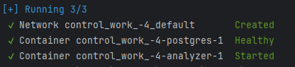
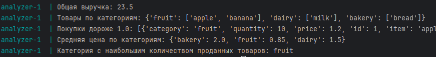

# Контрольная работа №4 по курсу "[Data Engineer с нуля до junior](https://stepik.org/course/137235/syllabus)"

Проект загружает продукты из мок файла _data_mock.json_ в БД Postgres.

Рееализованы следующие функций для анализа данных:

- **total_revenue(purchases):** Рассчитайте и верните общую выручку (цена * количество для всех записей).
- **items_by_category(purchases):** Верните словарь, где ключ — категория, а значение — список уникальных товаров в этой категории.
- **expensive_purchases(purchases, min_price):** Выведите все покупки, где цена товара больше или равна min_price.
- **average_price_by_category(purchases):** Рассчитайте среднюю цену товаров по каждой категории.
- **most_frequent_category(purchases):** Найдите и верните категорию, в которой куплено больше всего единиц товаров (учитывайте поле quantity).

## 🛠 Стэк технологий
- python 3.12
- - asyncpg
- - pydantic
- - sqlalchemy
- - alembic
- postgres
- docker
- - docker-compose

## ▶️ Запуск проекта

1. Скачиваем проект с гита
```shell
git clone https://github.com/lexa946/control_work_-4.git
```
2. Создать и заполнить файлы **.env** и **.env-postgres**
<details> 
    <summary>.env</summary>

    
    DB_USERNAME=<Пользователь БД>
    DB_PASSWORD=<Пароль БД>
    DB_NAME=<Имя БД>
    DB_HOST=<Хост БД>
    DB_PORT=<Порт БД>
    
</details>
<details> 
    <summary>.env-postgres</summary>

    
    POSTGRES_USER=<Пользователь БД>
    POSTGRES_PASSWORD=<Пароль БД>
    POSTGRES_DB=<Имя БД>
    
</details>

3. Нужно установить __docker__ и __docker-compose__. Это нужно сделать самостоятельно в зависимости какая у вас ОС.
4. Запускаем __docker-compose__ 
```shell
docker-compose up -d
```
5. Дожидаемся запуска.<br>Должно получится следующее:<br>

6. Проверяем отработку проекта
```shell
docker-compose logs analyzer
```

7. Завершаем работу докеров:
```shell
docker-compose down
```

## 🔐 Безопасность
Так как это учебный проект, то в сам репозиторий я загрузил и **.env** и **.env-postgres**. 
В реальных проектах нужно создавать свой на самом сервере. 

## Дополнение
Вы можете запускать проект не только с локальной БД (которую я в компоуз добавил), но и с любой другой. 
Достаточно в .env указать ваши данные для подключения к БД. В теории, тогда можно вообще не запускать компоуз,
а запустить только контейнер analyzer. Но нужно будет его предварительно сбилдить. 
